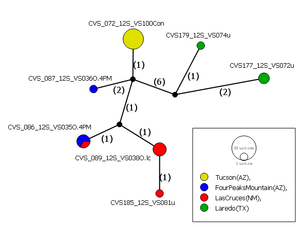
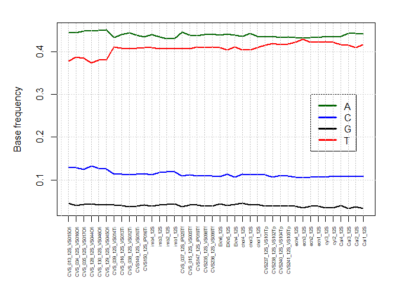
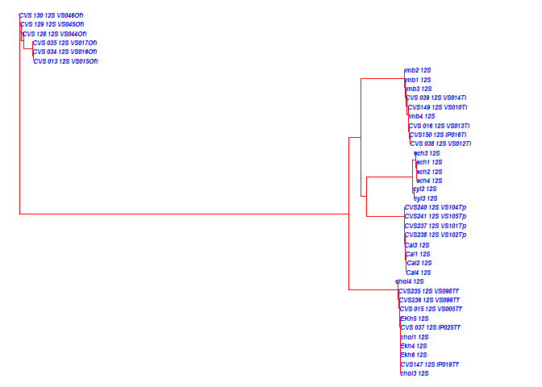
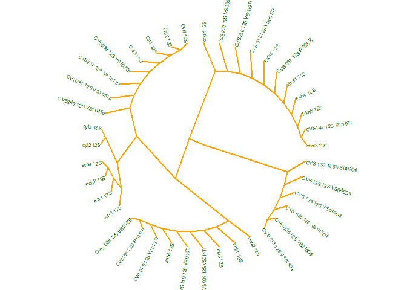

CBC Phylogenetics Tutorial 1
================
Clarke van Steenderen

<!-- <p style="color:red">text </p> -->

## Getting started

Open the “Chromatograms” folder. The sequencing facility will send you
three files for each sample, namely a **.ab1**, **.pdf**, and **.txt**
file. The data here are *Dactylopius opuntiae* and *D. tomentosus* 12S
rRNA sequences. For a quick ID, you can copy the FASTA sequence in the
.txt file, and paste it into the
[BLAST](https://blast.ncbi.nlm.nih.gov/Blast.cgi?PROGRAM=blastn&PAGE_TYPE=BlastSearch&LINK_LOC=blasthome)
search engine. It will show you what the top matches are relative to
what is available on the GenBank database.

## View and trim chromatograms

Have a look at the PDF chromatogram of the BCCS1-green\_12S file. You’ll
see that it’s a bit messy at the beginning, up to about 70 bp. The rest
looks clean, with excellent base calls. Compare this to one of the PDFs
in the “Poor\_quality\_chromatograms” folder.

Install [Chromas](http://technelysium.com.au/wp/chromas/), and open the
**BCCS1-green\_12S.ab1** file. Scroll to the 70 bp mark, and click on
the nucleotide at that point (here a C). Then Edit –\> Set left trim.
Then scroll to the 470 bp mark (here a G), click –\> Edit –\> Set right
trim. Then Edit –\> Delete trimmed sequences. Click Export, and save the
file with a .fasta or .fas extension. You would do this for all the
chromatograms, and then open all the resulting trimmed FASTA files in
AliView, and save it as one big FASTA file. Find this final file,
**12S\_unaligned.fasta**, in the **FASTA files** folder. These sequences
now need to be aligned.

## Align sequences

Open the [MAFFT](https://mafft.cbrc.jp/alignment/server/) server, and
upload the **12S\_unaligned.fas** file. Select the “Same as input” radio
buttons under the **UPPERCASE/lowercase** and **Output order** headings.
Submit, and then click on **Fasta format** at the top of the page to
download the alignment. The resulting file is called
**12S\_aligned\_mafft\_needs\_editing.fasta** in the FASTA files folder
in this repository. The beginnings and ends of the alignmed sequences
have a number of dashes. Replace these with the “N” character to signify
missing data. Do not do this for dashes elsewhere in the sequences, as
these indicate gaps, and may be biologically meaningful. The processed
file is called **12S\_aligned\_mafft\_ready.fasta**.

## Create a haplotype network in PopART

We’ll use some *Dactylopius confusus* 12S rRNA sequences for this.

PopART reads in Nexus files, and so you need to convert from .fasta to
.nex. There are many online converters, but I like
[EMBOSS](https://www.ebi.ac.uk/Tools/sfc/emboss_seqret/).

Step 1: Select DNA from the drop-down list, and then upload the
**12S\_confusus.fasta** file.

Step 2: Select the input format to be FASTA format including NCBI-style
IDs, and the output format as Nexus/paup (either interleaved or
non-interleaved).

Download the .nex file, and open it in Notepad++. Delete the three lines
that follow the first “end;” (begin assumptions; options deftype=unord;
end;).

This file is available as the **12S\_confusus\_for\_popart.NEX** file in
this repository. You can then add a TRAITS block section below the
sequences. This is used to specify groupings within your sequences
(e.g. geographic location or host plant), so that you can colour your
haplotype network accordingly. Have a look at the formatting in this
file.

Read the **12S\_confusus\_for\_popart.NEX** file into PopART. Network
–\> TCS network. Change colours by clicking Edit –\> Set trait colour.
I prefer to see mutations as numbers, so click on View –\> Show
mutations as –\> Numbers.



## Reading in genetic sequences and creating a distance matrix

``` r
if (!require("pacman")) install.packages("pacman") # pacman is a package that installs other required packages
```

    ## Loading required package: pacman

``` r
pacman::p_load(ape, ade4, pegas, magrittr)

# set your working directory. 
# You can easily do this by pressing ctrl + shift + H, then select the folder containing the file
# Then copy and paste the line produced in the console
setwd("~/CBC_tuts/Tutorial_1/FASTA files")
seqs = ape::read.dna("12S_aligned_mafft_ready.fasta", format = "fasta")
# get a basic summary of your file:
seqs 
```

    ## 40 DNA sequences in binary format stored in a matrix.
    ## 
    ## All sequences of same length: 420 
    ## 
    ## Labels:
    ## CVS_013_12S_VS015Ofi
    ## CVS_034_12S_VS016Ofi
    ## CVS_035_12S_VS017Ofi
    ## CVS_128_12S_VS044Ofi
    ## CVS_130_12S_VS046Ofi
    ## CVS_129_12S_VS045Ofi
    ## ...
    ## 
    ## Base composition:
    ##     a     c     g     t 
    ## 0.439 0.113 0.039 0.408 
    ## (Total: 16.8 kb)

``` r
# create a distance matrix. This is what is used to construct a phylogenetic tree
d = ape::dist.dna(seqs, model = "TN93", pairwise.deletion = T, as.matrix = T) 
# use ?dist.dna to see which other models are available. This uses the Tamura-Nei 93 model as an example
```

## Initial data exploration

``` r
# Generate a heat-map, where the darker the colour, the greater the distance between pairs of sequences
temp <- as.data.frame(d)
ade4::table.paint(temp, cleg=0, clabel.row=.5, clabel.col=.5) # cleg is for a legend, clabel.row and clabel.col are text sizes
```

<!-- -->

``` r
# Create a plot for base frequencies
basef <- matrix(NA, nrow=nrow(seqs), ncol=4)
rownames(basef) <- labels(seqs)
colnames(basef) <- c("A", "C", "G", "T")

for (i in 1: nrow(seqs)){
  
 basef[i,] <- base.freq(seqs[i,])
  
}
  
  par(mar=c(6,5,2,2))
  matplot(basef, type = "l", pch = 16, col =c("darkgreen", "blue", "black", "red"), 
          ylab = "Base frequency", xlab="", xaxt = "n", lty=1, lwd = 2)
  axis(1, at=1:nrow(seqs), labels=rownames(seqs), las=2, cex.axis = 0.5)
  legend(33, 0.3, c("A", "C", "G", "T"), lty=1, lwd = 3, bty="o", col =c("darkgreen", "blue", "black", "red"))
  abline(v=1:nrow(seqs), col="gray", lty=3)
  grid(NULL, NULL)
```

<!-- -->

## Create a neighbour joining (NJ) tree

Have a look [here](https://rdrr.io/cran/ape/man/plot.phylo.html) for
more parameters for tree plotting.

``` r
tree = ape::njs(d)
labels(seqs) # get a list of all the sequence names
```

    ##  [1] "CVS_013_12S_VS015Ofi" "CVS_034_12S_VS016Ofi" "CVS_035_12S_VS017Ofi"
    ##  [4] "CVS_128_12S_VS044Ofi" "CVS_130_12S_VS046Ofi" "CVS_129_12S_VS045Ofi"
    ##  [7] "CVS_039_12S_VS014Ti"  "CVS_016_12S_VS013Ti"  "CVS_038_12S_VS012Ti" 
    ## [10] "CVS149_12S_VS010Ti"   "CVS150_12S_IP016Ti"   "imb4_12S"            
    ## [13] "imb3_12S"             "imb2_12S"             "imb1_12S"            
    ## [16] "CVS_037_12S_IP025Tf"  "CVS_015_12S_VS005Tf"  "CVS147_12S_IP019Tf"  
    ## [19] "CVS235_12S_VS098Tf"   "CVS236_12S_VS099Tf"   "Ekh6_12S"            
    ## [22] "EKh5_12S"             "Ekh4_12S"             "chol4_12S"           
    ## [25] "chol3_12S"            "chol1_12S"            "CVS237_12S_VS101Tp"  
    ## [28] "CVS238_12S_VS102Tp"   "CVS240_12S_VS104Tp"   "CVS241_12S_VS105Tp"  
    ## [31] "ech4_12S"             "ech3_12S"             "ech2_12S"            
    ## [34] "ech1_12S"             "cyl3_12S"             "cyl2_12S"            
    ## [37] "Cal4_12S"             "Cal3_12S"             "Cal2_12S"            
    ## [40] "Cal1_12S"

``` r
# Root the tree on the outgroups. Here it was all the samples ending on "Ofi" (Dactylopius opuntiae 'ficus' biotype)
tree = root(tree, outgroup = c("CVS_013_12S_VS015Ofi", "CVS_034_12S_VS016Ofi", "CVS_035_12S_VS017Ofi", 
                               "CVS_128_12S_VS044Ofi", "CVS_130_12S_VS046Ofi", "CVS_129_12S_VS045Ofi"), 
                             resolve.root = T)
# Plot the tree
par(mar=c(2,2,2,2))
plot(tree, cex = 0.5, edge.color = "red", tip.color = "blue", font = 4, no.margin = T) 
```

<!-- -->

``` r
# Ladderise it, and then replot:
tree %>% ladderize(.,F) %>% plot(., cex = 0.5, edge.color = "blue", tip.color = "black", font = 4, no.margin = T, edge.width = 2)
# alternative notation (note the use of the pipe operator above (%>%), using the magrittr package):
# tree = ladderize(tree, F)
# plot(tree, cex = 0.8, edge.color = "red", tip.color = "blue", font = 4)

# add a scale bar
add.scale.bar(x = 0.3, y = 1, length = 0.1)
```

<!-- -->

``` r
# plot a radial tree
par(mar=c(2,2,2,2))
plot(tree, cex = 0.5, edge.color = "orange", tip.color = "darkgreen", font = 1, type = "r", no.margin = T, edge.width = 2.5) 
```

<!-- -->

``` r
# or an unrooted cladogram
plot(unroot(tree),type="unrooted",cex=0.6, use.edge.length=FALSE,lab4ut="axial", no.margin=TRUE, 
     tip.color = "darkgreen", edge.colo="brown", edge.width = 2.5)
```

<!-- -->
