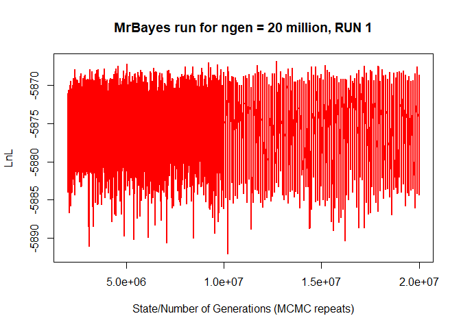
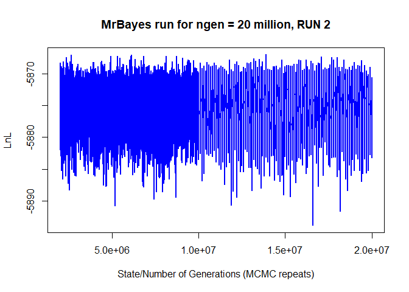
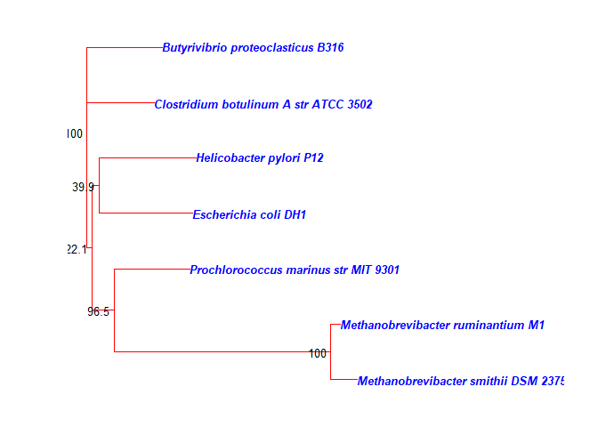
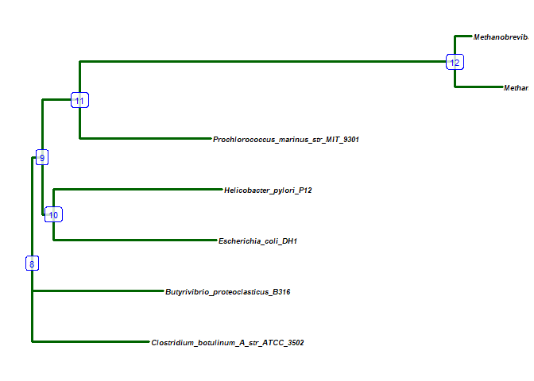
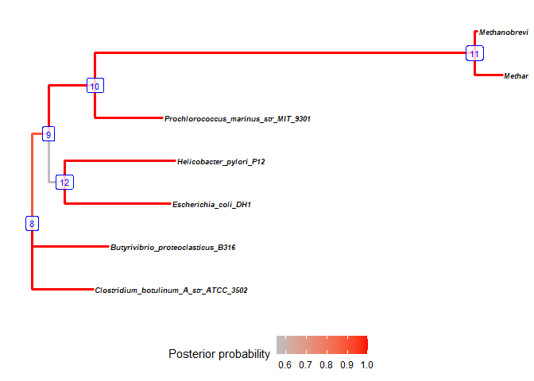
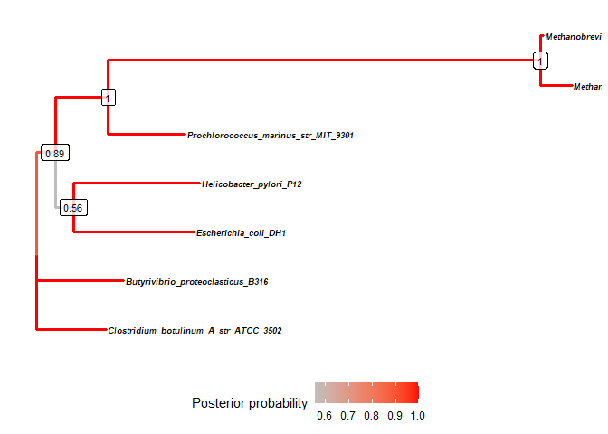
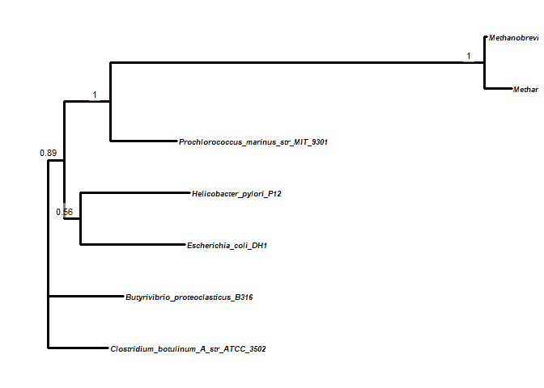
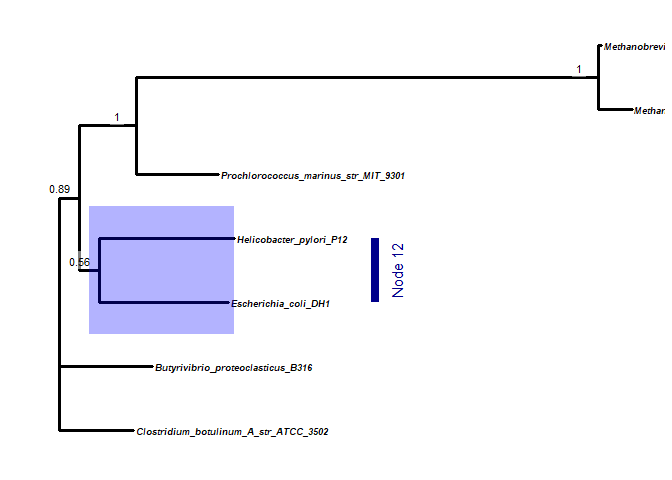
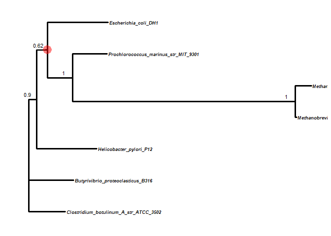

CBC Phylogenetics Tutorial 2
================
Clarke van Steenderen
Last updated 03/09/2020

## AIMS OF THIS TUTORIAL :white\_check\_mark:

1.  Plot a quick neighbour joining tree from aligned sequences, with
    bootstrapping
2.  Find the optimal evolutionary model for aligned sequence data using
    jModelTest
3.  Prepare a NEXUS file for MrBayes using these optimal parameters
4.  Create a Bayesian phylogeny
5.  Check the quality of the run
6.  Read the resulting tree file (.tre) into R to:
      - Plot the phylogeny using ape and ggtree
      - Tweak it by adding and/or colouring branches according to
        posterior probability values
7.  Compare a Bayesian analysis of 20 million generations to one of 10
    000

## DOCUMENT CONTENTS

1.  [Data Preparation](#dataprep)
2.  [Run MrBayes](#mrbayes)
3.  [ggtree for MrBayes output](#ggtree)

Create a profile on [CIPRES](http://www.phylo.org/). This is a very
useful online server that you can use to run numerous programs on a
server, so that you don’t have to run any analyses on your local PC. For
this tut, we’ll use
[jModelTest](https://www.ncbi.nlm.nih.gov/pmc/articles/PMC4594756/) to
find the best evolutionary model for our data and
[MrBayes](https://academic.oup.com/bioinformatics/article/17/8/754/235132)
to create a Bayesian phylogeny.

## Data Preparation <a name = "dataprep"></a>

To start preparing a NEXUS input file for MrBayes, you first need to
have created an aligned FASTA file of all your sequences, including
outgroups. You can easily add additional sequences from GenBank to your
unaligned file, and then align everything together. To add sequences,
from GenBank, select the ones you want by clicking on the radio buttons
next to the name, and then select “summary” at the top of the page –\>
FASTA (text) –\> ctrl + a to selct all –\> ctrl + c to copy all –\> open
AliView and press ctrl + v to paste.

For this tutorial, we’ll use 16S rRNA sequences obtained from seven
different bacterial species, taken from
[here](http://evomics.org/learning/phylogenetics/mrbayes/). These files
are in the **Tutorial 2/MrBayes** folder, saved as 16S.fas and 16S.nex.
Convert the aligned FASTA file to NEXUS format using
[EMBOSS](https://www.ebi.ac.uk/Tools/sfc/emboss_seqret/).

### Find the optimal evolutionary model using jModelTest

On CIPRES, upload the aligned 16S.fas file. Create a new task –\> input
the 16S.fas file –\> Select jModelTest2 as the tool –\> leave input
parameters as is –\> Save and run task. Upon completion, select
‘Output’, and from the list of files, click to view the **STDOUT**
file. Scroll to the **BAYESIAN INFORMATION CRITERION (BIC)** section
(:bulb: ctrl + f and type Bayesian to get there quickly). We’ll use this
information to set up a Bayesian block in the Nexus file we just
converted.

**This is the output from jModelTest:**

<span style="background-color:lightgreen"> Model selected:

Model = TIM3+G  
partition = 012032  
\-lnL = 5867.1837  
K = 19  
freqA = 0.2516  
freqC = 0.2276  
freqG = 0.3115  
freqT = 0.2093  
R(a) \[AC\] = 0.5943  
R(b) \[AG\] = 1.4398  
R(c) \[AT\] = 1.0000  
R(d) \[CG\] = 0.5943  
R(e) \[CT\] = 3.0841  
R(f) \[GT\] = 1.0000  
gamma shape = 0.4520

</span>

> We need to incorporate this into the template for a MrBayes block
> below. The sumt and sump burnin values discard the first 25% of trees
> created (ngen/samplefreq x 0.25. We can check whether the number of
> generations (ngen) was sufficient after the run has completed using
> Tracer. If you’re working with mitochondrial DNA from invertebrates,
> set **code =metmt**, for vertebrate mtDNA, set it to **code=vertmt**,
> otherwise set it to **code=universal**. Typically **nruns=2** and
> **nchains=4**. Anything in square brackets in a NEXUS file is not
> read, and so you can use this to make comments and notes.

begin mrbayes;  
set autoclose=yes nowarn=yes;  
lset nst= rates= ngammacat=4 code=;  
outgroup ;  
prset revmatpr=dirichlet(6 values) statefreqpr=dirichlet(four values)
shapepr=fixed(gamma shape) pinvarpr = fixed(pinvar) tratiopr =
fixed(kappa value); mcmc ngen= printfreq=1000 samplefreq= nruns=
nchains= savebrlens=yes starttree=random;  
sumt relburnin=yes burninfrac=0.25;  
sump relburnin=yes burninfrac=0.25;  
end;

-----

### :bulb: Some notes:

  - nst will depend on the model selected by jModelTest (MrBayes only
    accepts one of 1, 2, or 6):  
  - nst = 6 for GTR and SYM (TrNef = SYM)  
  - nst = 2 for HKY and K2P
  - nst = 1 for JC and F81
  - TIM1, TIM2, TIM3, TPM1uf, TPM2uf, TPM3uf, and TrN substitution
    models can be replaced by the GTR model. Have a look
    [here](https://gist.github.com/brantfaircloth/895282) for more
    information, and see [this
    paper](https://journals.plos.org/plosone/article?id=10.1371/journal.pone.0065642).
  - Model with no “+ I” or “+ G” –\> do not add a rates parameter
  - Model + G –\> rates = gamma
  - Model + I –\> rates = propinv
  - Model + I + G –\> rates = invgamma
  - ngammacat usually stays as 4  
  - Only one outgroup sequence name can be indicated  
  - “revmatpr” refers to the 6 substitution rates, if applicable.
    (A\<-\>C, A\<-\>G, A\<-\>T, C\<-\>G, C\<-\>T, and G\<-\>T)  
  - statefreqpr = dirichlet(x, y, z, a), where you include the
    probability frequencies of each base (A, C, G, and T)  
  - shapepr = fixed(gamma value)  
  - If there is a kappa value, then include tratiopr = fixed(kappa
    value)  
  - If there is a proportion of invariable sites (p-inv), then add
    pinvarpr = fixed(value)

> Using this information, we can now fill out the MrBayes block template
> with the jModelTest output. We will use *Clostridium botulinum* as the
> outgroup. Make sure that the name matches exactly to the name in the
> alignment. On the note of naming, make sure that none of the sequence
> names do not end on a fullstop (.), underscore (\_), or with one or
> more brackets, and also remove brackets within the name (this will
> save you a lot of frustration later on\!). We’ll set this run to 10
> 000 generations, and sampling frequency to 100. The
> Tutorial\_2/MrBayes folder contains the results of a run using both 10
> 000 and 20 million generations (infile.nex.con\_20M.tre and
> infile.nex.con\_10k.tre each with their two associated .p files for
> run1 and run2).

begin mrbayes;  
set autoclose=yes nowarn=yes;  
lset nst=**6** rates=**gamma** ngammacat=4 code=**universal**;  
outgroup **Clostridium\_botulinum\_A\_str\_ATCC\_3502**;  
prset
revmatpr=dirichlet(**0.5943**,**1.4398**,**1.0000**,**0.5943**,**3.0841**,**1.0000**)
statefreqpr=dirichlet(**0.2516**,**0.2276**,**0.3115**,**0.2093**)
shapepr=fixed(**0.4520**); mcmc ngen=**10000** printfreq=1000
samplefreq=**100** nruns=**2** nchains=**4** savebrlens=yes
starttree=random;  
sumt relburnin=yes burninfrac=0.25;  
sump relburnin=yes burninfrac=0.25;  
end;

> Now you can add this block to the aligned sequences in the 16S.nex
> file.

## Run MrBayes <a name = "mrbayes"></a>

Upload the **16S.nex** file to CIPRES, and then create a new task where
you select “MrBayes on XSEDE” as the tool. In the Input Parameters,
select that your data contains a MrBayes block, set the maximum hours to
168, and select “Run Beagle” (this speeds up the analysis). Leave the
other settings on their defaults. Save and run the task. You can click
on “View Status” –\> Intermediate results –\> and then download the
STDOUT.txt to see how far the analysis is.

> :warning: The most common errors come about due to unacceptable
> characters in sequence names, missing or incorrect syntax (missing
> commas, semi-colons etc.), or the incorrect number of characters
> specified in the file. Double check everything before running MrBayes.

### Tracer: check whether there were enough runs in the analysis

Once the task has completed, download the **infile.nex.run1.p**,
**infile.nex.run2.p**, and **infile.nex.con.tre** files. You would
typically open the two run.p files in Tracer, and make sure that all the
effective sample size (ESS) values are greater than 200.

You will see that the two .p files for the 10 000 generation run have
ESS values less than 200, and that the trace plots have not reached a
state of equilibrium. In order to have sufficient coverage, a much
larger number of generations needs to be set. Compare the ESS values for
the 20 million generation run to the 10 0000 run. You will see that all
the ESS scores for the 20 million run are \> 200.

> Let’s quickly have a look at the trace plots for the 10 000 and 20
> million Bayesian runs. The two .p files for each run were opened in
> Tracer. Both runs were highlighted, and then the Trace file was
> viewed. A data table was then exported as a .txt file (File –\> Export
> Data Table), and subsequently saved as a .csv file so that we can plot
> these in R. These two files are in the MrBayes folder, saved as
> **mrbayes\_10K\_run.csv** and **mrbayes\_20M\_run.csv**. Trace plots
> should look like a “fuzzy caterpillar”, as in the 20 million
> generation run.

``` r
# Plot the 10 000 generation run:
bayes10K.run = read.csv("https://raw.githubusercontent.com/CJMvS/CBC_Tutorials/master/Tutorial_2/MrBayes/mrbayes_10K_run.csv")
# Plot run 1
plot(bayes10K.run$state_run1, bayes10K.run$LnL_run1, lwd = 3, type = "l", col = "red", main = "MrBayes run for ngen = 10 000", xlab = "State/ngen", ylab = "LnL")
# Add run 2
points(bayes10K.run$state_run2, bayes10K.run$LnL_run2, lwd = 3, pch=16, type = "l", col="blue")
```

<!-- -->

``` r
# Plot the 2 million generation run:
bayes20M.run = read.csv("https://raw.githubusercontent.com/CJMvS/CBC_Tutorials/master/Tutorial_2/MrBayes/mrbayes_20M_run.csv")
# Run 1
plot(bayes20M.run$state_run1, bayes20M.run$LnL_run1, lwd = 2, type = "l", col = "red", main = "MrBayes run for ngen = 20 million, RUN 1", xlab = "State/ngen", ylab = "LnL")
```

<!-- -->

``` r
# Run 2
plot(bayes20M.run$state_run2, bayes20M.run$LnL_run2, lwd = 2, type = "l", col="blue", main = "MrBayes run for ngen = 20 million, RUN 2", xlab = "State/ngen", ylab = "LnL")
```

<!-- -->

The .con.tre file can now be opened in FigTree for quick viewing (the
tree can be saved to multiple formats from this program. You can save it
as a .svg file, and then edit it manually in a program like
[Inkscape](https://inkscape.org/). We will use R to create a pretty
phylogeny using the ggtree package.

## ggtree for MrBayes output <a name = "ggtree"></a>

Before starting with the Bayesian tree, let’s use the aligned FASTA
sequences to create a quick neighbour joining tree to get an idea of
what the relationships look like:

``` r
# devtools::install_github("GuangchuangYu/treeio") # install the treeio package using this line

if (!require("pacman")) install.packages("pacman") # pacman is a package that installs other required packages
```

    ## Loading required package: pacman

``` r
pacman::p_load(ape, ade4, pegas, magrittr, ggplot2, ggtree, treeio)

seqs = read.dna("https://raw.githubusercontent.com/CJMvS/CBC_Tutorials/master/Tutorial_2/MrBayes/16S.fas", format = "fasta") # read in the aligned FASTA file for the bacterial 16S rRNA sequences 
d = dist.dna(seqs, model = "TN93", pairwise.deletion = T, as.matrix = T) # Create a distance matrix
t = njs(d) # Create a NJ tree
t = ladderize(t)
plot(t, cex = 0.8, edge.color = "red", tip.color = "blue", font = 4)
nodelabels()
```

<!-- -->

``` r
# We can apply 1000 bootstrap runs to the tree:
bootstrap.reps = 1000
boots <- boot.phylo(t, seqs, function(x) njs(dist.dna(x, model = "TN93", pairwise.deletion = T)), B = bootstrap.reps, rooted = T)
```

    ## Running bootstraps:       100 / 1000Running bootstraps:       200 / 1000Running bootstraps:       300 / 1000Running bootstraps:       400 / 1000Running bootstraps:       500 / 1000Running bootstraps:       600 / 1000Running bootstraps:       700 / 1000Running bootstraps:       800 / 1000Running bootstraps:       900 / 1000Running bootstraps:       1000 / 1000
    ## Calculating bootstrap values... done.

``` r
t$node.label <- (boots/bootstrap.reps*100) # attach the bootstrap values as node labels
par(mar=c(2,4,2,2)) # set the margins
plot(t, cex = 0.8, edge.color = "red", tip.color = "blue", font = 4)
nodelabels(boots/bootstrap.reps*100, cex = 0.8, bg="white", frame = "none", adj = c(1.2, 0.5))
```

<!-- -->

``` r
# We can also plot using ggtree:
gg = t %>% ggtree(., color = "darkgreen", lwd = 1.2) + 
    geom_tiplab(size=2.5, color="black", font = 4) + 
    geom_label2(aes(subset=!isTip, label=node), size=3, color="blue", alpha=0.8)
gg
```

<!-- -->

Now let’s read in the result of the 10 000 generation Bayesian analysis:
:muscle:

``` r
bac.tree.10k = treeio::read.mrbayes("https://raw.githubusercontent.com/CJMvS/CBC_Tutorials/master/Tutorial_2/MrBayes/infile.nex.con_10k.tre") # read in the 10 000 generation tree file
# bac.tree.10k (run this line if you want to get an overall summary of what information the tree contains)

# Plot the phylogeny  with branches coloured according to posterior probability values, and add node numbers 
iotree = bac.tree.10k %>% ggtree(., aes(color=as.numeric(prob)), layout = "rectangular", lwd=1.2) + 
  geom_tiplab(size=2.5, color="black", font = 4) +
  geom_label2(aes(subset=!isTip, label=node), size=3, color="blue", alpha=0.8) + # add node numbers 
  theme(legend.position="bottom") +
  scale_color_continuous(low='grey', high='red', name="Posterior probability") 

iotree
```

<!-- -->

``` r
# add posterior probability values instead of node numbers 
iotree2 = bac.tree.10k %>% ggtree(., aes(color=as.numeric(prob)), layout = "rectangular", lwd=1.2) +
  geom_tiplab(size=2.5, color="black", font = 4) +
  geom_label2(aes(subset=!isTip, label=round(as.numeric(prob),2)), size=3, color="black", alpha=0.8) + 
  theme(legend.position="bottom") +
  scale_color_continuous(low='grey', high='red', name="Posterior probability") 

iotree2
```

<!-- -->

``` r
# just have plain black branches, but add posterior probability values
iotree3 = bac.tree.10k %>% ggtree(., color = "black", layout = "rectangular", lwd=1.2) +
  geom_tiplab(size=2.5, color="black", font = 4) +
  geom_label2(aes(subset=!isTip, label=round(as.numeric(prob),2)), size=3, color="black", alpha=0.5, label.size = 0, nudge_x = -0.025, nudge_y = 0.15)  # posterior probs. label.size = 0 removes the border around the labels 

iotree3
```

<!-- -->

``` r
# add in a blue highlight block for node 12, and add a vertical label
iotree4 = bac.tree.10k %>% ggtree(., color = "black", layout = "rectangular", lwd=1.2) +
  geom_tiplab(size=2.5, color="black", font = 4) +
  geom_label2(aes(subset=!isTip, label=round(as.numeric(prob),2)), size=3, color="black", alpha=0.5, label.size = 0, nudge_x = -0.025, nudge_y = 0.15) + # posterior probs 
  geom_hilight(node=12, fill="blue", alpha=0.3) +
  geom_cladelabel(12, "Node 12", offset=0.18, barsize=3, angle=90, offset.text=0.025, hjust=0.5, fontsize=4, colour =  "darkblue")

iotree4
```

<!-- -->

> Out of interest, we’ll view the phylogeny for the 20 million
> generation run as well, and compare that to the shorter 10 000 run.
> You will see that the low support value (0.56) for the *Helicobacter
> pylori* and *E. coli* clade fell away (marked with a red point in the
> phylogeny created below).

``` r
bac.tree.20M = treeio::read.mrbayes("https://raw.githubusercontent.com/CJMvS/CBC_Tutorials/master/Tutorial_2/MrBayes/infile.nex.con_20M.tre") # read in the 20 million generation run

iotree5 = bac.tree.20M %>% ggtree(., color = "black", layout = "rectangular", lwd=1.2) +
  geom_tiplab(size=2.5, color="black", font = 4) +
  geom_label2(aes(subset=!isTip, label=round(as.numeric(prob),2)), size=3, color="black", alpha=0.5, label.size = 0, nudge_x = -0.025, nudge_y = 0.15) + 
  geom_point2(aes(subset=node==10), color='red', size=6, pch = 16, alpha = 0.5) # add a round red point to node 10

iotree5
```

<!-- -->

``` r
# You can also flip clades and branches:

new <- rotate(iotree5, 10) 
new
```

<!-- -->

> :books: Tutorial 3 will have a look at running a Bayesian analysis
> with more than one gene, and how to run a maximum likelihood analysis
> on single and multigene data. Stay tuned\!
