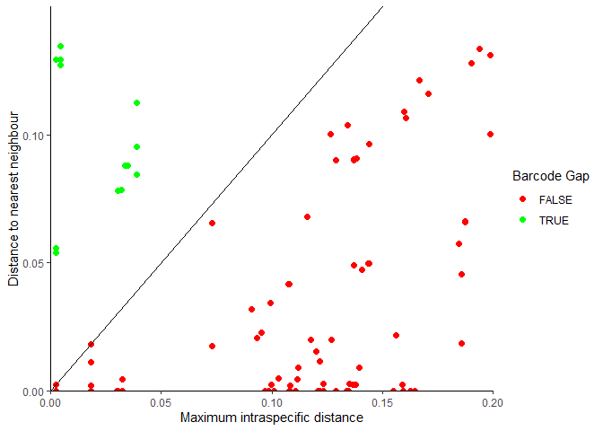
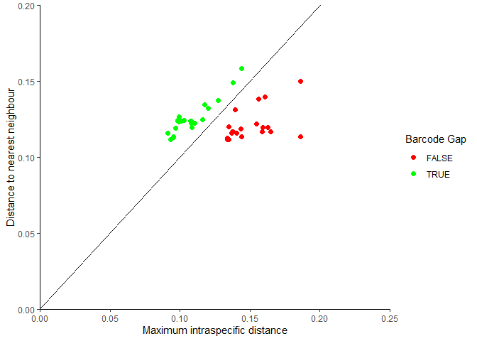
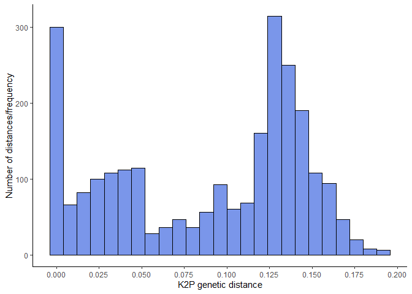
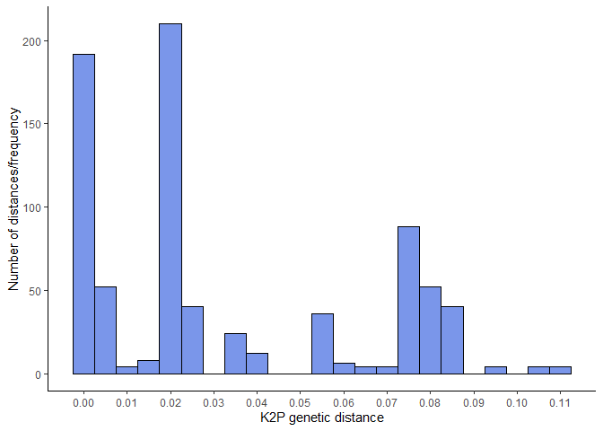
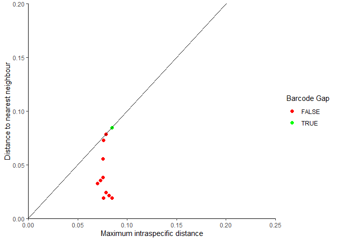
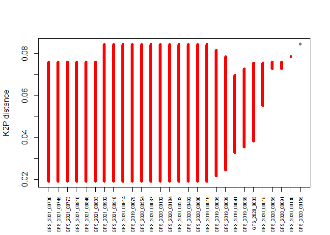

CBC Phylogenetics Tutorial 7: Barcode Gaps
================
Clarke van Steenderen
Last updated 28/10/2021

## AIMS OF THIS TUTORIAL :white\_check\_mark:

1.  Graphically represent barcode gaps from an aligned FASTA file
2.  Subset sequences into desired groups

🌳 The COI sequences in this dataset are from *Tetramesa* wasps (Hymenoptera: Eurytomidae), and produce the following dated BEAST phylogeny:


--- 

## R CODE: DETERMINING BARCODE GAPS

``` r
if (!require("pacman")) install.packages("pacman")
```

    ## Loading required package: pacman

``` r
pacman::p_load(ape, tidyr, reshape2, ggplot2, spider, readxl, magrittr)

# upload the FASTA file

tetra_seqs = ape::read.FASTA("data/tetramesa_COI.fasta")
tetra_seqs
```

    ## 120 DNA sequences in binary format stored in a list.
    ## 
    ## All sequences of same length: 516 
    ## 
    ## Labels:
    ## GFS_2021_00726
    ## GFS_2021_00730
    ## GFS_2021_00741
    ## GFS_2021_00745
    ## GFS_2021_00746
    ## GFS_2021_00749
    ## ...
    ## 
    ## Base composition:
    ##     a     c     g     t 
    ## 0.317 0.120 0.132 0.432 
    ## (Total: 61.92 kb)

``` r
# upload an Excel file with sequence information

source_mods = readxl::read_excel("data/source_modifiers.xlsx")

head(source_mods)
```

    ## # A tibble: 6 x 17
    ##     `#` `COI acc. num` `COI sequence` `28S sequence` Sequence_ID    Organism    
    ##   <dbl> <chr>          <lgl>          <chr>          <chr>          <chr>       
    ## 1     1 MT549821       TRUE           <NA>           GFS_2019_00019 Tetramesa s~
    ## 2     2 MT549822       TRUE           <NA>           GFS_2019_00030 Tetramesa s~
    ## 3     3 MT549823       TRUE           <NA>           GFS_2019_00035 Tetramesa s~
    ## 4     4 MT549823       TRUE           <NA>           GFS_2019_00039 Tetramesa s~
    ## 5     5 MT549825       TRUE           <NA>           GFS_2019_00041 Tetramesa s~
    ## 6     6 MT549826       TRUE           <NA>           GFS_2019_00043 Tetramesa s~
    ## # ... with 11 more variables: Golden shoulder <chr>, country <chr>,
    ## #   province <chr>, Latitude <dbl>, Longitude <dbl>, host <chr>,
    ## #   collected_by <chr>, collection_date <chr>, sex <chr>, Fwd_primer_seq <chr>,
    ## #   Rev_primer_seq <chr>

``` r
# out of interest, find what is in the source modifiers file that isn't in the sequence alignment to find missing sequences
setdiff(source_mods$Sequence_ID, names(tetra_seqs))
```

    ##  [1] "GFS_2019_00044" "GFS_2020_00086" "GFS_2020_00545" "GFS_2020_00667"
    ##  [5] "GFS052"         "GFS029"         "SPY_KZN_006"    "SPY_KZN_058"   
    ##  [9] "SPY_KZN_89"     "SPY_KZN_94"     "SPY_MPA_095"    "KCP_2020_00050"
    ## [13] "KCP_2020_00051" "KCP_2020_00056" "KCP_2020_00064" "KCP_2020_00065"
    ## [17] "KCP_2021_00080" "KCP_2021_00082" "KCP_2021_00083" "KCP_2021_00084"
    ## [21] "KCP_2021_00103" "KCP_2021_00127" "KCP_2021_00139" "KCP_2021_00142"
    ## [25] "KCP_2021_00149" "KCP_2021_00153" "KCP_2021_00158" "KCP_2021_00159"
    ## [29] "KCP_2021_00160" "KCP_2021_00161" "KCP_2021_00163" "KCP_2021_00164"
    ## [33] "KCP_2012_00171" "GFS_2021_00267" "GFS_2021_00302" "GFS_2021_00317"
    ## [37] "GFS_2021_00329" "GFS_2021_00355" "GFS_2021_00389" "GFS_2021_00750"
    ## [41] "GFS_2021_00751" "GFS_2021_00805"

``` r
# Use all the sequences in the FASTA file

spp_names = c()

# Go through each sequence name in the FASTA file, and search for it in the source_modifiers Excel sheet.  When a match is found, store the corresponding organism name for that sequence in the spp_names vector

for(i in 1:length(names(tetra_seqs))){
  for(j in 1:nrow(source_mods)){
    if(names(tetra_seqs)[i] == source_mods$Sequence_ID[j]) spp_names[i] = source_mods$Organism[j]
  }
}

# Check that the length of the spp_names and number of sequences are equal

length(spp_names) # 120
```

    ## [1] 120

``` r
length(tetra_seqs) # 120
```

    ## [1] 120

``` r
# Get the distance matrix for the COI sequences

dist_all = dist.dna(tetra_seqs, as.matrix = T, pairwise.deletion = T)

# Reshape the data in order to use it in ggplot later

dist_all_reshape = reshape::melt(dist_all)

# Using the spider package:

# Get the furthest intraspecific distance within each organism group
inter <- nonConDist(dist_all, spp_names) 

# And the closest, non-conspecific (i.e., interspecific distance)
intra <- maxInDist(dist_all, spp_names) 

# Find how many times there are no barcode gaps
length(which(inter-intra <= 0)) # 96
```

    ## [1] 96

``` r
# Create a dataframe with the intra and interspecific values

barcode_gap_vals = c()
barcode_gap_vals$intra = intra
barcode_gap_vals$inter = inter
barcode_gap_vals = as.data.frame(barcode_gap_vals)
gaps = barcode_gap_vals$intra < barcode_gap_vals$inter 

barcode_gap_vals$gap = gaps

# Plot barcode gap as a dot plot
barcode_gap_plot = 
  barcode_gap_vals %>%
  drop_na %>%
  ggplot(aes(x = intra, y = inter, colour = gap)) + 
  geom_point(size = 2) +
  scale_color_manual(values = c("red", "green"), name = "Barcode Gap") +
  geom_abline(intercept = 0, slope=1) +
  theme_classic() +
  scale_x_continuous(expand = c(0, 0), limits = c(0, 0.2)) + 
  scale_y_continuous(expand = c(0, 0), limits = c(0, 0.15)) +
  ylab("Distance to nearest neighbour") +
  xlab("Maximum intraspecific distance")

barcode_gap_plot
```

<!-- -->

``` r
# Plot barcode gap as a histogram

barcode_gap_hist = ggplot(data = dist_all_reshape, aes(x = value)) + 
  geom_histogram(binwidth = 0.005, fill = "royalblue", col = "black", alpha = 0.7) +
  xlab("K2P genetic distance") +
  ylab("Number of distances/frequency") +
  scale_x_continuous(breaks = seq(0, 0.3, by = 0.025)) +
  theme_classic() 

barcode_gap_hist
```

<!-- -->

``` r
# have a look at the barcode gap for each sequence. From the manual to the spider package: "grey lines represent the furthest intraspecific distance (bottom of line value), and the closest interspecific distance (top of line value). The red lines show where this relationship is reversed, and the closest non-conspecific is actually closer to the query than its nearest conspecific, i.e., situation where there is no barcoding gap

bnd <- cbind(data.frame(inter, intra))
ord <- bnd[order(bnd$inter),]
plot(ord$inter, type="n", ylab="K2P distance",xlab="", xaxt = "n")
segCol <- rep("gray50", length(ord$inter))
segCol[ord$inter-ord$intra < 0] <- "red"
segments(x0=1:length(ord$inter), y0=ord$inter, y1=ord$intra, col=segCol, lwd=6)
axis(1, at=1:length(ord$inter), labels=names(tetra_seqs), las=2, cex.axis=0.55)
```

<!-- -->

### :pushpin: Perhaps we want to compare all sequences that have been classified as Organisms “Tetramesa sp.4” and “Tetramesa sp.5”. To subset this, one can do the following:

``` r
t4_and_t5 = which(source_mods$Organism == "Tetramesa sp.4" | source_mods$Organism == "Tetramesa sp.5") ;t4_and_t5
```

    ##  [1]   1   2   3   4   5   6   7   8   9  10  11  12  16  18  19  20  21  22  23
    ## [20]  24  25  27  28  29  31  32  33  34  35  38  40  44  45  46  48  50  52  68
    ## [39]  69  70  71  72  74  76  77  78  80  81  82  83  85  87  88  90  91 126 128
    ## [58] 131 132 134

``` r
t4_and_t5_names = source_mods$Sequence_ID[t4_and_t5] ;t4_and_t5_names
```

    ##  [1] "GFS_2019_00019" "GFS_2019_00030" "GFS_2019_00035" "GFS_2019_00039"
    ##  [5] "GFS_2019_00041" "GFS_2019_00043" "GFS_2019_00044" "GFS_2019_00063"
    ##  [9] "GFS_2019_00069" "GFS_2019_00079" "GFS_2020_0003"  "GFS_2020_00015"
    ## [13] "GFS_2020_00055" "GFS_2020_00079" "GFS_2020_00083" "GFS_2020_00085"
    ## [17] "GFS_2020_00086" "GFS_2020_00087" "GFS_2020_00091" "GFS_2020_00102"
    ## [21] "GFS_2020_00111" "GFS_2020_00120" "GFS_2020_00130" "GFS_2020_00132"
    ## [25] "GFS_2020_00155" "GFS_2020_00184" "GFS_2020_00196" "GFS_2020_00233"
    ## [29] "GFS_2020_00492" "GFS_2020_00554" "GFS_2020_00562" "GFS_2020_00595"
    ## [33] "GFS_2020_00606" "GFS_2020_00614" "GFS_2020_00638" "GFS_2020_00667"
    ## [37] "GFS_2020_00680" "KCP_2020_00012" "KCP_2020_00019" "KCP_2020_00032"
    ## [41] "KCP_2020_00033" "KCP_2020_00036" "KCP_2020_00039" "KCP_2020_00041"
    ## [45] "KCP_2020_00044" "KCP_2020_00045" "KCP_2020_00048" "KCP_2020_00050"
    ## [49] "KCP_2020_00051" "KCP_2020_00052" "KCP_2020_00055" "KCP_2020_00061"
    ## [53] "KCP_2020_00062" "KCP_2020_00064" "KCP_2020_00065" "GFS_2021_00302"
    ## [57] "GFS_2021_00317" "GFS_2021_00354" "GFS_2021_00355" "GFS_2021_00374"

``` r
length(t4_and_t5_names)
```

    ## [1] 60

``` r
# now subset the FASTA file into these samples of interest
tetra_seqs_subsetted = subset(tetra_seqs, names(tetra_seqs) %in% t4_and_t5_names) ;tetra_seqs_subsetted
```

    ## 50 DNA sequences in binary format stored in a list.
    ## 
    ## All sequences of same length: 516 
    ## 
    ## Labels:
    ## GFS_2021_00354
    ## GFS_2021_00374
    ## GFS_2020_00614
    ## GFS_2020_00562
    ## KCP_2020_00012
    ## KCP_2020_00019
    ## ...
    ## 
    ## Base composition:
    ##     a     c     g     t 
    ## 0.318 0.123 0.130 0.430 
    ## (Total: 25.8 kb)

``` r
# if there is not a sequence for all the names in the source modifiers file (maybe some sequences didn't work), then one can look for which particular names are missing in the FASTA file, and remove those from the list of extracted names (t4_and_t5_names):
diffs = setdiff(t4_and_t5_names, names(tetra_seqs_subsetted))
indx = which(t4_and_t5_names %in% diffs) ; indx
```

    ##  [1]  7 17 36 48 49 54 55 56 57 59

``` r
t4_and_t5_names = t4_and_t5_names[-indx]

# write this as a FASTA file if desired:
# write.dna(tetra_seqs_subsetted, "tetra_sp4_sp_5.fas", format = "fasta")

# get distance matrices for the subsetted FASTA file
tetra_seqs_subsetted.dist = dist.dna(tetra_seqs_subsetted, as.matrix = T, pairwise.deletion = T)
# get the distance matrix into an appropriate format for ggplot
tetra_dists = reshape::melt(tetra_seqs_subsetted.dist)

# store the organism names for each sequence
spp_names = c()

for(i in 1:length(names(tetra_seqs_subsetted))){
  for(j in 1:nrow(source_mods)){
    if(names(tetra_seqs_subsetted)[i] == source_mods$Sequence_ID[j]) spp_names[i] = source_mods$Organism[j]
  }
}

# Get the furthest intraspecific distance within each organism group
inter <- spider::nonConDist(tetra_seqs_subsetted.dist, spp_names) ; inter 
```

    ##  [1] 0.1194445 0.1196829 0.1221768 0.1114958 0.1159025 0.1186052 0.1134942
    ##  [8] 0.1394461 0.1238135 0.1166967 0.1167272 0.1238135 0.1238135 0.1114958
    ## [15] 0.1234717 0.1130156 0.1156181 0.1132885 0.1221768 0.1114958 0.1193907
    ## [22] 0.1248293 0.1114958 0.1221768 0.1346063 0.1319568 0.1373727 0.1491428
    ## [29] 0.1382417 0.1499347 0.1585092 0.1221768 0.1199079 0.1236036 0.1191833
    ## [36] 0.1244667 0.1311232 0.1134942 0.1224104 0.1263585 0.1224104 0.1224104
    ## [43] 0.1169607 0.1157200 0.1127171 0.1236036 0.1168987 0.1217916 0.1236036
    ## [50] 0.1242318

``` r
# And the closest, non-conspecific (i.e., interspecific distance)
intra <- spider::maxInDist(tetra_seqs_subsetted.dist, spp_names) ; intra
```

    ##  [1] 0.10838125 0.16253839 0.10812039 0.13468918 0.14067068 0.14354425
    ##  [7] 0.14392103 0.16078430 0.10777699 0.16474701 0.15891367 0.10750051
    ## [13] 0.10750051 0.09342204 0.09931644 0.09529109 0.09105179 0.09529109
    ## [19] 0.10812039 0.13468918 0.15927108 0.11589270 0.13379349 0.10812039
    ## [25] 0.11784044 0.11997777 0.12717501 0.13817384 0.15605070 0.18594212
    ## [31] 0.14392103 0.10812039 0.13500531 0.10103816 0.09690957 0.10301881
    ## [37] 0.13943732 0.18594212 0.11078704 0.09960016 0.11078704 0.11078704
    ## [43] 0.13766240 0.13675373 0.13400338 0.10788013 0.13799468 0.15488553
    ## [49] 0.09850840 0.09850840

``` r
# Find how many times there are no barcode gaps
length(which(inter-intra <= 0))
```

    ## [1] 21

``` r
barcode_gap_vals = c()
barcode_gap_vals$intra = intra
barcode_gap_vals$inter = inter
barcode_gap_vals = as.data.frame(barcode_gap_vals)
gaps = barcode_gap_vals$intra < barcode_gap_vals$inter 

barcode_gap_vals$gap = gaps

# Plot barcode gap as a dot plot
barcode_gap_plot = 
  barcode_gap_vals %>%
  drop_na %>%
  ggplot(aes(x = intra, y = inter, colour = gap)) + 
  geom_point(size = 2) +
  scale_color_manual(values = c("red", "green"), name = "Barcode Gap") +
  geom_abline(intercept = 0, slope=1) +
  theme_classic() +
  scale_x_continuous(expand = c(0, 0), limits = c(0, 0.25)) + 
  scale_y_continuous(expand = c(0, 0), limits = c(0, 0.2)) +
  ylab("Distance to nearest neighbour") +
  xlab("Maximum intraspecific distance")

barcode_gap_plot
```

<!-- -->

``` r
# plot the barcode gap as a histogram
barcode_gap = ggplot(data = tetra_dists, aes(x = value)) + 
  geom_histogram(binwidth = 0.008, fill = "royalblue", col = "black", alpha = 0.7) +
  xlab("K2P genetic distance") +
  ylab("Number of distances/frequency") +
  scale_x_continuous(breaks = seq(0, 0.3, by = 0.025)) +
  theme_classic() ; barcode_gap
```

<!-- -->

``` r
# have a look at the barcode gap for each sequence. From the manual to the spider package: "grey lines represent the furthest intraspecific distance (bottom of line value), and the closest interspecific distance (top of line value). The red lines show where this relationship is reversed, and the closest non-conspecific is actually closer to the query than its nearest conspecific, i.e., situation where there is no barcoding gap

bnd <- cbind(data.frame(inter, intra))
ord <- bnd[order(bnd$inter),]
plot(ord$inter, type="n", ylab="K2P distance",xlab="", xaxt = "n")
segCol <- rep("gray50", length(ord$inter))
segCol[ord$inter-ord$intra < 0] <- "red"
segments(x0=1:length(ord$inter), y0=ord$inter, y1=ord$intra, col=segCol, lwd=6)
axis(1, at=1:length(ord$inter), labels=names(tetra_seqs_subsetted), las=2, cex.axis=0.55)
```

<!-- -->

### :pushpin: If one wants to subset the sequences based on a few conditions the following code can be used. For example, “extract all the specimens with a golden shoulder, from the Eastern Cape whose host plant is *Eragrostis curvula*, and all the specimens with a golden shoulder, from KwaZulu Natal, and whose host plant is *Eragrostis trichophora*”:

``` r
EC_KZN = which( (source_mods$`Golden shoulder` == "Yes" & source_mods$province == "EC" & source_mods$host == "Eragrostis curvula") | (source_mods$`Golden shoulder` == "Yes" & source_mods$province == "KZN" & source_mods$host == "Eragrostis trichophora") )
# check the names extracted
EC_KZN_names = source_mods$Sequence_ID[EC_KZN]
# remove some if desired
EC_KZN = EC_KZN[-c(26,33)]
# subset the sequences based on the extracted names
EC_KZN_seqs_subsetted = subset(tetra_seqs, names(tetra_seqs) %in% EC_KZN_names);EC_KZN_seqs_subsetted
```

    ## 28 DNA sequences in binary format stored in a list.
    ## 
    ## All sequences of same length: 516 
    ## 
    ## Labels:
    ## GFS_2021_00730
    ## GFS_2021_00745
    ## GFS_2021_00773
    ## GFS_2021_00810
    ## GFS_2021_00846
    ## GFS_2021_00883
    ## ...
    ## 
    ## Base composition:
    ##     a     c     g     t 
    ## 0.314 0.126 0.127 0.433 
    ## (Total: 14.45 kb)

``` r
# make sure that the subsetted sequences correspond with the extracted names
EC_KZN_spp_names = c()

for(i in 1:length(names(EC_KZN_seqs_subsetted))){
  for(j in 1:nrow(source_mods)){
    if(names(EC_KZN_seqs_subsetted)[i] == source_mods$Sequence_ID[j]) EC_KZN_spp_names[i] = source_mods$Organism[j]
  }
}

# get distances
EC_KZN_seqs_subsetted.dist = dist.dna(EC_KZN_seqs_subsetted, as.matrix = T, pairwise.deletion = F)
EC_KZN_seqs_subsetted.dist_2 = reshape::melt(EC_KZN_seqs_subsetted.dist)

# Plot a barcode gap histogram
barcode_gap_2 = ggplot(data = EC_KZN_seqs_subsetted.dist_2, aes(x = value)) + 
  geom_histogram(binwidth = 0.005, fill = "royalblue", col = "black", alpha = 0.7) +
  xlab("K2P genetic distance") +
  ylab("Number of distances/frequency") +
  scale_x_continuous(breaks = seq(0, 0.2, by = 0.01)) +
  theme_classic() ;barcode_gap_2
```

<!-- -->

``` r
# Get the furthest intraspecific distance within each organism group
inter <- spider::nonConDist(EC_KZN_seqs_subsetted.dist, EC_KZN_spp_names) ; inter 
```

    ##  [1] 0.01891842 0.07293270 0.01891842 0.01891842 0.01891842 0.01891842
    ##  [7] 0.01891842 0.07293270 0.01891842 0.01891842 0.05535812 0.01891842
    ## [13] 0.03549603 0.03270854 0.03829521 0.07865084 0.08465642 0.01891842
    ## [19] 0.01891842 0.01891842 0.02441508 0.01891842 0.02167325 0.01891842
    ## [25] 0.01891842 0.01891842 0.01891842 0.01891842

``` r
# And the closest, non-conspecific (i.e., interspecific distance)
intra <- spider::maxInDist(EC_KZN_seqs_subsetted.dist, EC_KZN_spp_names) ; intra
```

    ##  [1] 0.07601002 0.07601002 0.07601002 0.07601002 0.07601002 0.07601002
    ##  [7] 0.07601002 0.07601002 0.08462325 0.08462325 0.07569444 0.08462325
    ## [13] 0.07278547 0.06986327 0.07572044 0.07866183 0.08462325 0.08462325
    ## [19] 0.08462325 0.08462325 0.07866832 0.08462325 0.08162923 0.08462325
    ## [25] 0.08462325 0.08462325 0.08462325 0.08462325

``` r
# Find how many times there are no barcode gaps
length(which(inter-intra <= 0))
```

    ## [1] 27

``` r
# Create a dataframe with the intra and interspecific values
barcode_gap_vals = c()
barcode_gap_vals$intra = intra
barcode_gap_vals$inter = inter
barcode_gap_vals = as.data.frame(barcode_gap_vals)
gaps = barcode_gap_vals$intra < barcode_gap_vals$inter 

barcode_gap_vals$gap = gaps

ggplot(data= barcode_gap_vals, aes(x = intra, y = inter, colour = as.factor(gaps))) + 
  geom_point(size = 2) +
  scale_color_manual(values = c("red", "green"), name = "Barcode Gap") +
  geom_abline(intercept = 0, slope=1) +
  theme_classic() +
  scale_x_continuous(expand = c(0, 0), limits = c(0, 0.25)) + 
  scale_y_continuous(expand = c(0, 0), limits = c(0, 0.2)) +
  ylab("Distance to nearest neighbour") +
  xlab("Maximum intraspecific distance")
```

<!-- -->

``` r
# have a look at the barcode gap for each sequence. From the manual to the spider package: "grey lines represent the furthest intraspecific distance (bottom of line value), and the closest interspecific distance (top of line value). The red lines show where this relationship is reversed, and the closest non-conspecific is actually closer to the query than its nearest conspecific, i.e., situation where there is no barcoding gap

bnd <- cbind(data.frame(inter, intra))
ord <- bnd[order(bnd$inter),]
plot(ord$inter, type="n", ylab="K2P distance",xlab="", xaxt = "n")
segCol <- rep("gray50", length(ord$inter))
segCol[ord$inter-ord$intra < 0] <- "red"
segments(x0=1:length(ord$inter), y0=ord$inter, y1=ord$intra, col=segCol, lwd=6)
axis(1, at=1:length(ord$inter), labels=names(EC_KZN_seqs_subsetted), las=2, cex.axis=0.55)
```

<!-- -->
